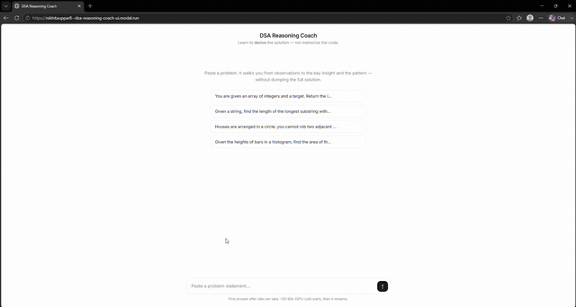
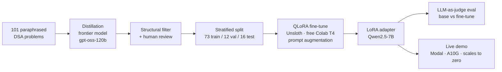

# DSA Reasoning Coach

> A small, self-hosted LLM that teaches you how to **derive** a Data Structures & Algorithms
> solution — observations, the bottleneck, the key insight, the pattern — instead of handing you
> the code. Distilled from a frontier model into a **Qwen2.5-7B + LoRA** model you can run yourself.

**Live demo:** https://nikhitauppar8--dsa-reasoning-coach-ui.modal.run
&nbsp;·&nbsp; **Adapter:** [`MoistPotato/dsa-reasoning-coach-7b-lora`](https://huggingface.co/MoistPotato/dsa-reasoning-coach-7b-lora)

*(The demo runs on a GPU that scales to zero when idle — the first request after a while pays a
~30–60s cold start, then streams. It runs on free GPU credits, so it may be paused at times; the
GIFs below are a full walkthrough either way.)*



<details>
<summary>Another example</summary>


</details>

---

## Why this is interesting

This is an **end-to-end fine-tuning project** — data pipeline + custom evaluation + a deployed
model — not a prompt wrapper. The product behavior is *enforced by the fine-tune*, two things a
base model won't reliably do **without being told**:

1. Answer in a fixed **8-section teaching format**
   (Observations → Brute force → Bottleneck → Key insight → Pattern → Optimized approach →
   Complexity → Generalizable lesson).
2. **Refuse to dump runnable code** — it teaches the *thinking*, not the solution.

The live demo sends only a **minimal** system prompt (`"You are a helpful DSA tutor."`). The format
and the no-code-leak behavior are **internalized by the fine-tune**, not injected via the prompt.
That is the headline result.

---

## Headline result

Held-out **16 problems**, **no schema in the prompt**, greedy decoding, LLM-as-judge
(Cerebras `gpt-oss-120b`). Base = stock Qwen2.5-7B-Instruct with the *same* minimal prompt.

| Criterion | Base | Fine-tuned 7B | Δ |
|---|---|---|---|
| Format adherence (/2) | 0.00 | 1.94 | **+1.94** |
| Insight correctness (/2) | 1.56 | 1.56 | +0.00 |
| Complexity correct (/2) | 0.44 | 1.50 | **+1.06** |
| Answer not leaked (/1) | 0.00 | 1.00 | **+1.00** |
| **TOTAL (/7)** | **2.00** | **6.00** | **+4.00** |

With no schema in the prompt, the base model free-forms and **dumps full code on all 16 problems**;
the fine-tune emits the teaching format and refuses code — a **3× total-score win**, while holding
**insight parity** (the 7B teacher explains the idea in words as correctly as the base does by
pasting code).

---

## The story (what the numbers actually taught me)

The interesting part wasn't a clean win — it was a falsified hypothesis and the fix.

1. **Hypothesis:** fine-tuning teaches better reasoning than the base model.
2. **Falsified at 3B:** with the schema *in* the prompt, base Qwen already aces famous LeetCode
   problems — no reasoning headroom to add. Strip the schema and the 3B fine-tune behaved *exactly
   like base* (format ~0, leaked code 16/16). The behavior was conditioned on the prompt, not learned.
3. **Diagnosed:** the format was bound to the *instruction text*, not the task.
4. **One-variable fix — prompt augmentation:** retrain rotating the system prompt per example over
   `{full schema, minimal, none}`. Same data, same hypers — only the prompt varied. Now the
   fine-tune emits the format + refuses code **with no schema in the prompt** (3B: +3.12 total).
5. **Scaled to 7B:** the one regression at 3B (insight, the model's reasoning ceiling) closes —
   insight reaches **parity** while keeping the full **+4.00** win. (Table above.)

---

## Architecture



**Pipeline:** paraphrased problem statements → frontier-model derivations → structural + human
quality filter → stratified split → QLoRA fine-tune (with prompt augmentation) → custom
LLM-as-judge evaluation → deploy.

---

## Tech stack

| Stage | Tools |
|---|---|
| Data generation | Cerebras `gpt-oss-120b` (frontier teacher), few-shot anchored on 5 gold examples |
| Training | Unsloth QLoRA on free Colab T4, TRL/PEFT, LoRA r=16, 3 epochs |
| Base model | `Qwen/Qwen2.5-7B-Instruct` (bf16 at serve time) |
| Evaluation | Custom LLM-as-judge (`scripts/judge_eval.py`), greedy/deterministic |
| Serving | Modal — custom FastAPI single-page UI, A10G GPU, scales to zero (idle = free) |

---

## Repo guide

```
data/
  problem_list.json     101 classic problems across 16 patterns
  processed/            train.jsonl (73) / val.jsonl (12) / test.jsonl (16, held out)
  gold/                 5 hand-written gold examples (the schema anchor)
  eval/                 base-vs-finetune outputs + judge scores
scripts/
  generate_data.py      distillation: (problem, derivation) pairs, provider-agnostic, resume-safe
  filter_data.py        structural quality filter (8 sections, Big-O, no code leak, dedupe)
  split_data.py         deterministic stratified-by-pattern split (SEED=42)
  judge_eval.py         LLM-as-judge: format / insight / complexity / no-leak rubric
  inspect_data.py       human-review viewer
deploy/
  modal_app.py          the live demo (custom FastAPI UI + streaming, Modal A10G)
  DEPLOY_MODAL.md       deploy steps
  app.py                HF ZeroGPU Gradio fallback (unused)
QLoRA.ipynb             the training notebook
schema.md               the 8-section reasoning schema (the product's backbone)
```

---

## Run the demo locally / redeploy

```bash
pip install modal
modal setup                              # one-time browser auth (free Starter plan)
modal serve  deploy/modal_app.py         # temporary URL, live while running
modal deploy deploy/modal_app.py         # permanent URL
```

The base model + adapter are baked into the Modal image at build time, so cold starts load from
local disk.

---

## Limitations & honest notes

- **16-problem held-out test set** — small; numbers are directional, not a benchmark.
- The win is **behavioral** (format + no-code-leak + complexity) plus **insight parity** — *not* a
  claim that the model out-reasons frontier models on hard problems.
- The judge is itself an LLM; the rubric is in `scripts/judge_eval.py`.
- Built end-to-end on **free** compute (Colab T4 training, Modal scale-to-zero serving).

## License

Apache-2.0. Base model: Qwen2.5-7B-Instruct (Apache-2.0).
